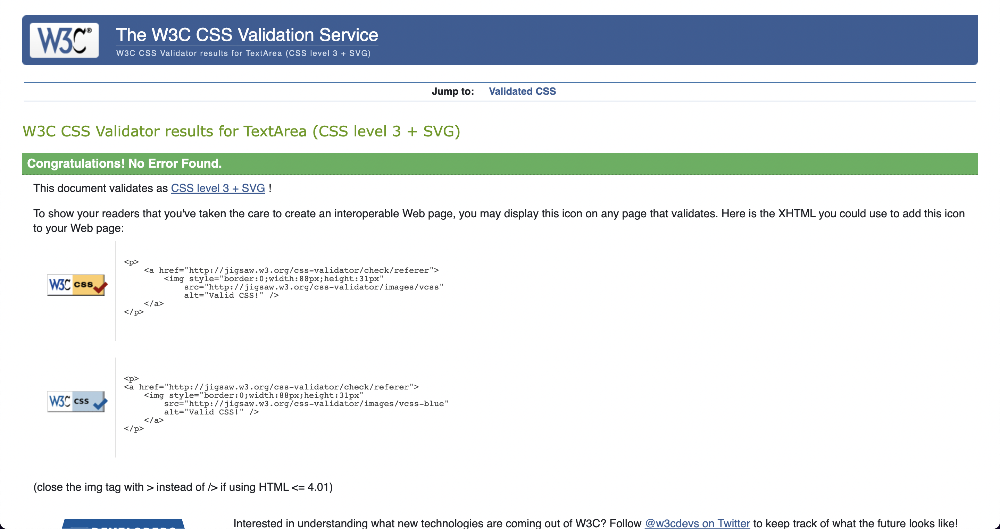

<h1>Rock, Paper, Scissors</h1>

Deployed website - https://nikkilemon.github.io/rock-paper-scissors/

Github - 

<h2>Intro</h2>

For this project I have created a Rock Paper Scissors game. This game utilizes HTML & CSS, with the main purpose of this project is to show the JavaScript skills I have learnt from the Code Institute module. The aim of the game is for the user to player the computer in a game of chance, the site's goal is to create a entertaining game for the player and challenging them to beat the computer. 

<h3>Rules:</h3>

The user chooses between Rock, Paper or Scissors and the computer will randomly do the same. 
<ul>
<li>Rock beats Scissors</li>
<li>Paper beats Rock</li>
<li>Scissors beats Paper</li>
</ul>
There is an infinte amount of goes on this game so you can keep playing as much as you would like. 

<h2>Features</h2>

I plan to include the following features:
<ul>
<li>The ability to play against the computer</li>
<li>Colour coding so if you win, tie or loose it will show either, green, yellow or orange to indicate your result</li>
</ul>

<h2>UX</h2>

I plan to incorporate the following into the user experience:
<ul>
<li>A game that is easy to understand and entertaining for the user</li>
<li>Make the game visually appealing to the user with complimentary colors and icons</li>
<li>The game should work without any bugs or faults</li>
</ul>

<h2>Design</h2>

I used Coolors to get a complimentary palette to add to the visual experience of the user. I used the following: 
<ul>
<li>#264653 - dark blue</li>
<li>#264653 - teal</li>
<li>#264653 - yellow</li>
<li>#264653 - peach</li>
<li>#264653 - orange</li>
</ul>

<h2>Features</h2>
<h3>Main Screen</h3>
    
<h3>Header</h3>

<h3>User Button Choices</h3>

<h3>Result Descriptions</h3>

<h3>Footer</h3>

<h2>Unfixed Bugs</h2>

There a couple of things I would like to change to the site and resolve going forward. I would like to add a counter score so that the user can see their score against the computer. I would also like to add Lizard and Spock into the game to make this more interesting and entertaining for the users. 
Another thing I would like to change would be the arrangement of the text once you know you have won/tie/lost, I would like it to read "Your choice vs Computer choice" with the icons from the game. I have left it as it is at the moment with both choices going underneath eachother

<h2>Validation Credits</h2>
<h3>W3c HTML Validation service</h3>

<h3>W3c CSS Validation service</h3>

<h3>JSHint</h3>

<h3>WebDev Tools Chrome </h3>

I used web dev tools to do a Lighthouse check in chrome to access the quality & accessibility of the webpage. It gave me insight into how the RockPaperScissors website performed & scored highly in Performance, Accessibility, Best Practices & SEO for both desktop & mobile devices

<h4>Mobile Devices</h4>

<h4>Desktop Devices</h4>

<h2>Deployment</h2>

The site was deployed to GitHub pages. The steps to deploy are as follows: In the GitHub repository, navigate to the Settings tab From the source section drop-down menu, select the Master Branch Once the master branch has been selected, the page will be automatically refreshed with a detailed ribbon display to indicate the successful deployment. The live link can be found here - https://nikkilemon.github.io/rock-paper-scissors/

<h2>Credits</h2>

Contents

<ul>
<li>The icons used from the game and the footer were from FontAwesome</li>
<li>The font on the site was from Google Fonts and is called Raleway
</ul>

<h2>Acknowledgements</h2>
<ul>
<li>Martina-mentor - Martina was a massive help to me in this project and I have completed it feeling confident and happy with the outcome</li>
<li>Code Institute Slack Channel - where was fellow sudents helped me overcome overwhelming sections and issues I was finding in JS. </li>
<li>Rob Selway - a friend who helped me really understand JS and going back to the basics again when I needed the help. 